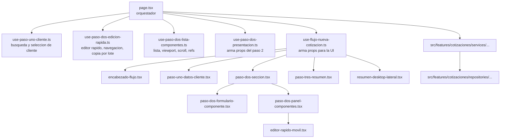

# Nueva cotizacion: mapa rapido

Este directorio contiene el wizard de `cotizaciones/nueva`.

La idea actual es simple:

- `page.tsx` orquesta el flujo
- cada paso visual vive en componentes separados
- cada bloque de logica sensible vive en hooks locales
- la logica de negocio real sigue en `src/features/cotizaciones/...`
- el paso 2 ahora tiene una puerta unica:
  - `./_components/paso-dos-seccion.tsx`
  - `./_hooks/use-paso-dos-presentacion.ts`

## Diagrama rapido

## Que archivo tocar segun el cambio

Si quieres cambiar solo el encabezado del wizard:

- `./_components/encabezado-flujo.tsx`

Si quieres cambiar solo el paso 1 visual:

- `./_components/paso-uno-datos-cliente.tsx`

Si quieres cambiar busqueda, autocompletado o seleccion de cliente:

- `./_hooks/use-paso-uno-cliente.ts`

Si quieres cambiar el formulario del paso 2:

- `./_components/paso-dos-formulario-componente.tsx`

Si quieres cambiar la composicion general del paso 2:

- `./_components/paso-dos-seccion.tsx`
- `./_hooks/use-paso-dos-presentacion.ts`

Si quieres cambiar el editor rapido o la logica de navegar entre componentes:

- `./_hooks/use-paso-dos-edicion-rapida.ts`
- `./_components/editor-rapido-movil.tsx`

Si quieres cambiar la lista del paso 2, su scroll o como se mantiene visible el item activo:

- `./_hooks/use-paso-dos-lista-componentes.ts`
- `./_components/paso-dos-panel-componentes.tsx`

Si quieres cambiar el resumen final del paso 3:

- `./_components/paso-tres-resumen.tsx`

Si quieres cambiar el resumen lateral de desktop:

- `./_components/resumen-desktop-lateral.tsx`

Si quieres cambiar como se reparten props entre componentes:

- `./_hooks/use-flujo-nueva-cotizacion.ts`

Si quieres cambiar guardado, validaciones o calculos:

- `src/features/cotizaciones/services/...`

Si quieres cambiar acceso a Supabase:

- `src/features/cotizaciones/repositories/...`

## Regla practica

Antes de editar, pregunta:

1. Esto es UI local del paso
2. Esto es estado local del wizard
3. Esto es negocio
4. Esto es datos

La respuesta define el archivo correcto:

- UI local: `_components/`
- estado local del wizard: `_hooks/`
- negocio: `src/features/cotizaciones/services/`
- datos: `src/features/cotizaciones/repositories/`

## Para no romper otras vistas

Si el pedido dice:

- "solo movil", parte por `editor-rapido-movil.tsx` o `paso-dos-panel-componentes.tsx`
- "solo desktop", parte por `resumen-desktop-lateral.tsx`
- "solo cliente", parte por `use-paso-uno-cliente.ts`
- "solo lista", parte por `use-paso-dos-lista-componentes.ts`
- "solo copiar medidas", parte por `use-paso-dos-edicion-rapida.ts`

## Perimetro recomendado para la reestructuracion del paso 2

Si vas a rediseñar el flujo de creacion de componentes, parte solo desde este bloque:

- `./_components/paso-dos-formulario-componente.tsx`
- `./_components/paso-dos-panel-componentes.tsx`
- `./_components/editor-rapido-movil.tsx`
- `./_components/paso-dos-seccion.tsx`
- `./_hooks/use-paso-dos-edicion-rapida.ts`
- `./_hooks/use-paso-dos-lista-componentes.ts`
- `./_hooks/use-paso-dos-tarjetas-componentes.ts`
- `./_hooks/use-paso-dos-presentacion.ts`

Intenta no tocar de entrada:

- `./page.tsx`
- `./_hooks/use-persistencia-nueva-cotizacion.ts`
- `./_hooks/use-paso-tres-guardado.ts`
- `app/print/cotizaciones/[id]/...`
- `src/features/cotizaciones/services/cotizaciones.service.ts`
- `src/features/cotizaciones/repositories/...`

La idea es esta:

- paso 2 = UI y estado local del editor
- persistencia = guardar, bootstrap, restauracion
- paso 3 = salida comercial y PDF
- services/repositories = negocio y datos

## Checklist antes de tocar paso 2

- si cambias solo la lectura o jerarquia visual, no toques persistencia
- si cambias navegacion entre tarjetas, no toques PDF
- si cambias copiado por lote o borradores rapidos, corre los tests del paso 2
- si cambias validacion de componentes, actualiza tests puros en `workflow-ui`
- si necesitas meter mas de 2 responsabilidades nuevas, crea un hook local nuevo en vez de crecer `page.tsx`

## Tests de seguridad para esta zona

Antes de una reestructuracion grande, al menos corre:

- `npm test -- --runInBand workflow-ui-step-two`
- `npm test -- --runInBand use-paso-tres-guardado`
- `npm run build`

## Anti patron

Evitar volver a meter todo en `page.tsx`.

Si aparece una nueva logica local grande y toca:

- mas de un `useState`
- mas de un `useEffect`
- mas de dos callbacks relacionados

entonces probablemente merece un hook local nuevo.
