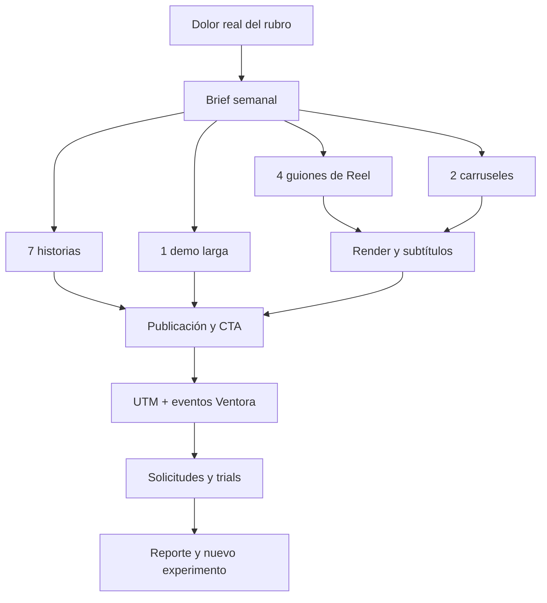

# Ventora Marketing Operating System

**Versión:** 1.0  
**Fecha:** 17 de agosto de 2026  
**Objetivo:** convertir contenido entretenido y demostrable en solicitudes calificadas, trials activados y clientes pagados.

## 1. Decisión estratégica

Ventora no debe competir diciendo “somos el cotizador más técnico”. Esa batalla favorece a sistemas especializados en cubicación y perfilería.

La categoría que Ventora puede apropiarse es:

> **El sistema comercial móvil para que una solicitud no se pierda en WhatsApp y llegue a una cotización enviada.**

El mecanismo diferencial que debe repetirse en todo el marketing es:

**Capturar → centralizar → cotizar → enviar → aprobar.**

Ventora puede comunicar, demostrar y medir:

- Página pública o link por empresa para recibir solicitudes.
- Bandeja centralizada para no buscar pedidos entre audios y chats.
- Cotización desde celular o computador.
- PDF con branding y enlace público.
- Compartir por WhatsApp.
- Aprobación o rechazo desde un enlace.
- Links y QR por canal para saber de dónde llegó cada solicitud.
- Flujo comercial completo, no solo cálculo técnico.

No prometer que Ventora reemplaza un sistema técnico de perfiles. Prometer velocidad, orden y seguimiento comercial.

## 2. La verdad incómoda sobre “marketing salvaje”

No existe una estrategia que garantice ventas “sí o sí”. MyCOCOS no vendió solo porque el producto fuera mediocre: combinó una promesa simple, humor reconocible, distribución insistente, oferta clara, demostración y seguimiento. La lección útil es construir una marca fácil de recordar y repetir el mensaje muchas veces; no copiar literalmente su tono sexual.

La meta correcta es crear un sistema que produzca suficientes experimentos para encontrar mensajes ganadores y que conecte cada pieza con una acción comercial medible.

## 3. Gran idea de campaña

### Campaña principal: “El cementerio de cotizaciones”

**Enemigo:** la cotización enterrada en WhatsApp, una libreta, una captura de pantalla o la memoria del dueño.

**Frase central:**

> “Tu cliente no siempre te dejó en visto. A veces tú dejaste su solicitud enterrada.”

**Promesa:**

> “Con Ventora, cada solicitud queda registrada y puedes convertirla en cotización desde el teléfono antes de que el cliente se vaya con otro.”

**Oferta de entrada:**

> “Reto 7 días sin perder solicitudes: crea tu página, comparte tu link y envía tu primera cotización.”

### Tono

Directo, reconocible, con humor de taller y terreno. Chileno cuando aporte naturalidad; nunca usar humor que ridiculice al cliente ni afirmaciones técnicas que Ventora no pueda sostener.

### Franquicias creativas repetibles

| Franquicia | Conflicto | Formato | CTA |
|---|---|---|---|
| WhatsApp no es CRM | 28 chats, 9 audios y una cotización perdida | Reel/sketch | “Escribe DEMO” |
| Cotización fantasma | El cliente pidió precio y nadie sabe dónde quedó | Reel con pantalla | “Prueba Ventora 7 días” |
| Antes/después | Libreta + chat versus flujo centralizado | Carrusel | “Guarda este post” |
| Reto 2 minutos | Crear y compartir una cotización en tiempo real | Reel demo | “Haz el reto” |
| El cliente que dijo “lo pienso” | Seguimiento perdido por falta de orden | Historias/encuesta | “¿Te ha pasado?” |
| Minuto de margen | Cotizar rápido sin regalar utilidad | Carrusel educativo | “Comenta MARGEN” |

## 4. Arquitectura del contenido

La producción semanal parte de una sola idea comercial y la convierte en múltiples activos.



### Cadencia mínima durante 30 días

- 5 Reels/Shorts por semana.
- 2 carruseles por semana.
- 5–7 historias por semana con encuesta, prueba social o CTA.
- 1 demo larga cada dos semanas.
- 1 caso o testimonio real por semana cuando exista autorización.
- 1 bloque semanal de respuesta a comentarios y seguimiento de solicitudes.

Distribución prioritaria: Instagram Reels, TikTok, Facebook Reels y YouTube Shorts. Los carruseles viven principalmente en Instagram/Facebook. LinkedIn es secundario para alianzas, proveedores y empresas más estructuradas; no debe absorber el esfuerzo inicial.

Para vídeo vertical, usar 9:16, subtítulos grandes, una idea por pieza y el producto visible temprano. Meta recomienda captar atención desde los primeros segundos y diseñar para visualización sin sonido; los recursos oficiales también recomiendan formato vertical y zonas seguras.

## 5. Primer banco de hooks vendibles

1. “Si cotizas en WhatsApp, probablemente ya perdiste una venta esta semana.”
2. “El problema no es que el cliente no responda. El problema es que nunca encontraste su mensaje.”
3. “28 chats, 14 audios y una cotización que desapareció. Bienvenido al rubro.”
4. “Esto no es un cotizador técnico. Es lo que evita que tu solicitud termine en el limbo.”
5. “Mándame una medida y te respondo después. La frase que más ventas mata.”
6. “¿Cuánto vendes mientras estás instalando? Probablemente cero, si nadie captura las solicitudes.”
7. “Tu cliente no necesita saber cómo trabajas por dentro. Necesita recibir una cotización clara.”
8. “El maestro que responde primero no siempre es el más barato.”
9. “Una cotización en PDF se ve distinta a un precio perdido entre audios.”
10. “Si tu negocio depende de tu memoria, no tienes un sistema: tienes suerte.”
11. “Reto: crear una cotización y enviarla desde el teléfono antes de que termine este video.”
12. “¿Te llegan solicitudes por Instagram, WhatsApp y conocidos? Entonces necesitas una sola bandeja.”

### Regla de guion para Reels

```text
0–2 s: conflicto visual y frase incómoda.
2–6 s: mostrar el caos concreto.
6–18 s: demostrar una sola función de Ventora.
18–25 s: resultado comercial observable.
25–30 s: CTA único.
```

No poner tres beneficios, tres botones y tres llamados a la acción en una misma pieza. Una pieza = un problema = una acción.

## 6. Workflow automatizado

### Flujo semanal

| Momento | Automatización | Salida |
|---|---|---|
| Lunes 08:00 | Leer métricas de Windsor.ai y eventos de Ventora | Top/bottom de contenido y embudo |
| Lunes 09:00 | Generar brief con dolor, audiencia, objeción y CTA | Brief versionado |
| Lunes 10:00 | Generar guiones, carruseles, historias y metadata | Paquete de contenido |
| Lunes 12:00 | Validación humana de exactitud y tono | Aprobado/rechazado |
| Martes | Renderizar vídeos con plantilla Remotion y generar subtítulos | MP4 9:16 + portada |
| Miércoles–Domingo | Publicar y responder comentarios | Alcance, conversaciones y clics |
| Diario | Registrar UTM, solicitud, trial, primera cotización y pago | Atribución comercial |
| Viernes | Redistribuir ganador y pausar formatos débiles | Nuevo test |

### Pseudoflujo para GitHub Actions / scheduler

```yaml
name: ventora-marketing-weekly
on:
  schedule:
    - cron: "0 12 * * 1"
  workflow_dispatch:

jobs:
  prepare-content:
    steps:
      - checkout
      - fetch_metrics:
          sources: [windsor_facebook_organic, ventora_internal_events]
      - score_previous_content:
          primary_metrics: [qualified_requests, trial_activation, paid_conversion]
      - generate_brief:
          output: marketing/briefs/YYYY-MM-DD.md
      - generate_content_pack:
          outputs: [reels.json, carousels.json, stories.json, captions.json]
      - validate_claims:
          fail_on: [unsupported_feature,_fake_testimonial,missing_cta,missing_utm]
      - request_human_approval
      - render_remotion
      - publish_or_queue
      - write_weekly_report
```

Este workflow puede generar y validar materiales. La publicación automática requiere conectar un scheduler o las APIs de cada red; no se debe asumir que Windsor.ai publica contenido. Mientras no estén conectados Instagram, TikTok, YouTube y GA4, la etapa `publish_or_queue` debe dejar una cola aprobada para publicación manual.

### Estructura sugerida en el repositorio de Ventora

```text
marketing/
  brand-voice.md
  positioning.md
  content-pillars.md
  utm-taxonomy.md
  calendar.csv
  briefs/
  scripts/
  carousels/
  captions/
  renders/
  reports/
scripts/marketing/
  generate-brief.ts
  score-content.ts
  validate-claims.ts
  build-utm.ts
.github/workflows/
  marketing-weekly.yml
```

## 7. Métricas: lo que importa y lo que no

### North Star

**Solicitudes calificadas por semana que avanzan a una conversación o cotización.**

La métrica de negocio final es **clientes pagados por campaña**. El alcance solo es una métrica de distribución.

### Embudo medible

| Etapa | Evento | Objetivo operativo inicial |
|---|---|---:|
| Atención | Retención a 3 s / primer frame | Mejorar semana a semana; cortar hooks débiles |
| Interés | Visita al perfil por alcance | ≥ 1,5% como hipótesis inicial |
| Intención | Clic UTM al sitio | ≥ 1% del alcance en piezas CTA |
| Captura | Registro o solicitud | ≥ 8% de sesiones CTA |
| Activación | Primera cotización creada | ≥ 50% de registros |
| Valor | Primera cotización compartida | ≥ 35% en 48 h |
| Conversión | Trial a pago | ≥ 15% como objetivo inicial |
| Velocidad | Tiempo solicitud → contacto | Mediana < 15 min en horario comercial |
| Eficiencia | CAC | Recuperable en ≤ 4 meses del plan mensual |
| Retención | Churn mensual | Bajar cada cohorte; medir por plan |

Estos son objetivos de gestión para Ventora, no benchmarks universales. No tomar decisiones con likes, seguidores o reproducciones aisladas. Un Reel con 20.000 reproducciones y cero solicitudes es un activo de awareness, no un ganador comercial.

### Score de contenido

```text
Score = 40% solicitudes calificadas
      + 25% clics UTM
      + 20% retención de vídeo
      + 10% compartidos/guardados
      +  5% comentarios útiles
```

Cada semana se deben elegir:

- 1 ganador de negocio para redistribuir o promocionar.
- 1 ganador de atención para rehacer con otro CTA.
- 1 perdedor para documentar qué no repetir.

## 8. Instrumentación obligatoria

### UTM estándar

```text
utm_source   = instagram | tiktok | facebook | youtube | whatsapp
utm_medium   = organic | paid | creator | bio | story
utm_campaign = reto_7_dias | cotizacion_fantasma | demo_2_minutos
utm_content  = r01 | r02 | c01 | s01
utm_id       = YYYYMMDD_content_id
```

Google Analytics recomienda usar parámetros UTM consistentes para identificar qué campañas refieren tráfico. En Ventora, esos parámetros deben conservarse desde la llegada al sitio hasta `solicitudes_contacto`, registro, primera cotización y pago.

### Eventos prioritarios

```text
landing_view
cta_click
request_started
request_submitted
signup_completed
first_quote_created
first_quote_shared
trial_started
subscription_started
payment_succeeded
```

Cada evento debe incluir `utm_source`, `utm_medium`, `utm_campaign`, `utm_content`, `source_url`, `organization_id` cuando corresponda y un `content_id` estable. No almacenar datos personales innecesarios en plataformas publicitarias.

## 9. Línea base real observada

Consulta de Windsor.ai sobre la página Facebook de Ventora, período aproximado 20 de mayo–17 de agosto de 2026:

- 30 seguidores al 17 de agosto.
- 29 seguidores ganados en el período, concentrados en un pico de junio.
- Un Reel medido del 15 de junio: 335 reproducciones, 287 de alcance único, 7,2 segundos de visualización promedio y 8 reproducciones al 95%.
- Después del pico de junio, la cadencia visible fue prácticamente nula.

Interpretación: existe evidencia de que una pieza o campaña puede producir distribución, pero no existe todavía un sistema repetible de publicación, atribución y conversión. La prioridad no es diseñar un logo más llamativo; es pasar de publicaciones aisladas a 30 días de experimentación disciplinada.

## 10. Plan de ejecución de 30 días

### Semana 1: dolor y categoría

- Lanzar “El cementerio de cotizaciones”.
- Publicar 5 Reels sobre WhatsApp, memoria, audios y respuestas tardías.
- Publicar 2 carruseles: “cotizador técnico vs sistema comercial” y “qué pasa desde la solicitud hasta el pago”.
- CTA único: `Escribe DEMO` o link con UTM, no ambos en la misma pieza.

### Semana 2: demostración

- 5 Reels con pantalla real: solicitud pública, bandeja, cotización móvil, PDF, aprobación.
- Reto de 2 minutos con cronómetro visible.
- Primer vídeo largo: “Cómo crear y enviar una cotización desde el teléfono”.

### Semana 3: objeciones y confianza

- “No soy bueno con tecnología”.
- “Ya uso Excel/WhatsApp”.
- “Necesito cubicación técnica”.
- “Mis clientes no van a llenar formularios”.
- Mostrar límites de Ventora con honestidad: es capa comercial, no CAD ni ERP.

### Semana 4: oferta y prueba

- Reto 7 días.
- Demo con un caso real autorizado.
- Comparación antes/después con tiempos medidos, sin inventar ahorros.
- Retargeting a visitantes y personas que vieron 50% o más del vídeo, cuando exista volumen suficiente.

## 11. Prompt de implementación para el agente de Ventora

```text
Implementa un Marketing Operating System dentro del repositorio de Ventora sin tocar la lógica de cubicación, pricing, PDF ni autenticación existente.

Objetivo:
Crear una capa interna para planificar, versionar, validar y medir contenido de marketing.

Requisitos:
1. Crear rutas o panel administrativo para briefs, piezas, campañas, UTM y resultados.
2. Registrar content_id, pillar, format, hook, CTA, status, publish_at, platform y campaign.
3. Añadir generador seguro de UTM usando utm_source, utm_medium, utm_campaign, utm_content y utm_id.
4. Preservar UTMs hasta solicitudes_contacto, signup_completed, first_quote_created, first_quote_shared, trial_started y payment_succeeded.
5. Crear dashboard de embudo por campaña y contenido: alcance, clics, solicitudes, registros, primera cotización, primera cotización compartida y pagos.
6. Crear validación que bloquee afirmaciones de funcionalidades no existentes, testimonios sin autorización, CTAs vacíos y piezas sin UTM.
7. Preparar integración de métricas Windsor.ai como fuente externa; no inventar APIs de publicación.
8. Preparar exportación o cola para Remotion: guion, escenas, textos, duración, formato 9:16, subtítulos y safe zones.
9. Añadir documentación en marketing/ y un workflow .github/workflows/marketing-weekly.yml con ejecución manual y programada.
10. No crear un CRM nuevo ni duplicar solicitudes_contacto. Reutilizar el modelo actual y respetar organization_id/RLS.

Criterios de aceptación:
- Puedo crear un brief semanal y derivar varias piezas con el mismo content_id raíz.
- Puedo construir un enlace UTM y comprobar que llega a la solicitud.
- Puedo ver qué contenido generó solicitudes, trials y pagos.
- Puedo marcar una pieza como aprobada, publicada, pausada o ganadora.
- La validación rechaza claims no soportados.
- No se rompe ninguna ruta crítica del cotizador.
```

## 12. Decisiones inmediatas

1. Conectar Instagram, GA4, Search Console, TikTok y YouTube a Windsor.ai o a una fuente equivalente.
2. Definir un único CTA de adquisición para 30 días: `Prueba Ventora 7 días`.
3. Grabar cinco demostraciones reales: crear línea, configurar línea, cotizar en computador, cotizar en teléfono y compartir/aprobar.
4. Implementar eventos y UTMs antes de escalar publicidad.
5. Publicar 30 días sin cambiar el posicionamiento cada tres días.
6. Revisar resultados cada viernes usando solicitudes, activación y pagos; no likes.

## Fuentes externas consultadas

- MyCOCOS: [La receta de MyCocos para vender US$ 5 millones](https://www.df.cl/df-mas/punto-de-partida/el-negocio-de-cuidado-masculino-que-causa-furor-en-redes-sociales-y)
- Meta: [Best practices for Instagram video ads](https://www.facebook.com/business/help/188534925073536)
- Meta: [Video advertising best practices](https://www.facebook.com/business/resources/video-advertising)
- Google Analytics: [URL builders and campaign parameters](https://support.google.com/analytics/answer/10917952?hl=en)
